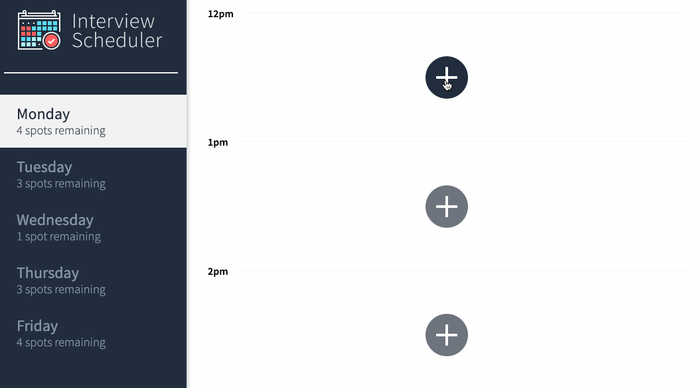

# Interview Scheduler

## Project Description
Interview Scheduler is a single page application React applicaiton that allows users to book and cancel interviews. Data is persisted by the API server using a PostgreSQL database.

Tests were performed using Storybook, Jest, and Cypress.

## Features
- Days of the week show spots remaining
- Users can switch between each day's schedule
- Users can book interviews by entering a student name and selecting an interviewer
  - Spots remaining in day are updated
- Users can change details of an existing interview
- Users can cancel existing interviews
  - Spots remaining in day are updated

### Day views

### Making new appointment

### Editing appointment

### Deleting appointment

## Project Stack
Front-end: React, Axios, JSX, HTML, Javascript

Back-end: Express, Node.js, PostgreSQL

Testing: Storybook, Jest, Cypress

## Dependencies
- `axios`
- `classnames`
- `normalize.css`
- `react`
- `react-dom`
- `react-scripts`

## Dev Dependencies
- `@babel/core: ^7.4.3`
- `@storybook/addon-actions: ^5.0.10`
- `@storybook/addon-backgrounds: ^5.0.10`
- `@storybook/addon-links: ^5.0.10`
- `@storybook/addons: ^5.0.10`
- `@storybook/react: ^5.0.10`
- `@testing-library/jest-dom: ^4.0.0`
- `@testing-library/react: ^8.0.7`
- `@testing-library/react-hooks: ^8.0.1`
- `babel-loader: 8.1.0`
- `prop-types: ^15.8.1`
- `react-test-renderer: ^16.14.0`
- `sass: ^1.53.0`

## Setup
### App
- install all dependencies (`npm install`)
- set up [API server](https://github.com/lighthouse-labs/scheduler-api)
- run both server and client (`npm start`)
### Jest Test Framework
- `npm test`
### Storybook Visual Testbed
- `npm run storybook`
### Cypress
- `npm run cypress`